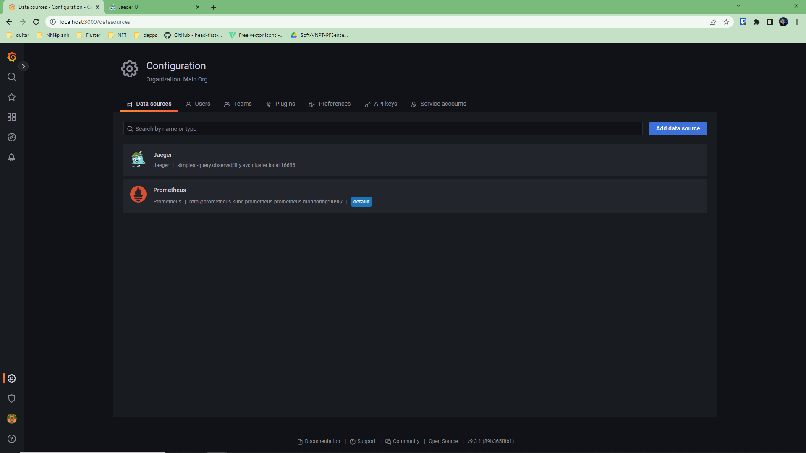
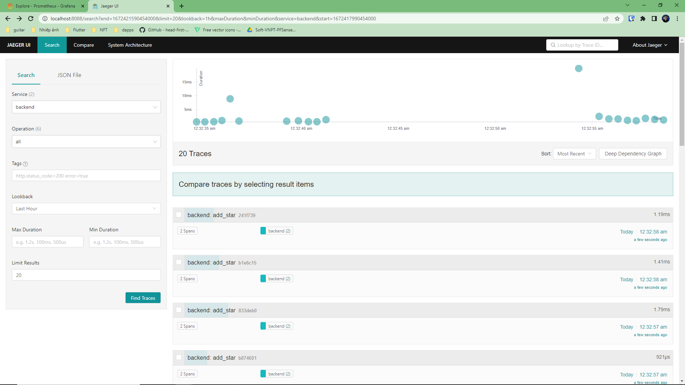

**Note:** For the screenshots, you can store all of your answer images in the `answer-img` directory.

## Verify the monitoring installation


## Setup the Jaeger and Prometheus source


## Create a Basic Dashboard


## Describe SLO/SLI
SLOs:
  - The application will have 95% uptime per month
  - 90% of the request will take no more than 200ms to serve per month
SLIs:
  - Measure how many error requests during the month
  - Measure the average time taken to return a request during the month

## Creating SLI metrics.
  - Uptime frontend: 
  - Uptime backend:
  - Frontend requests's response time: Create metrics show frontend requests's response time
  - Backend requests's response time: Create metrics show frontend requests's response time
  - Backend and backend request's errors: 
## Create a Dashboard to measure our SLIs


## Tracing our Flask App



## Jaeger in Dashboards


## Report Error
TROUBLE TICKET

Name: Error when getting stars from database

Date: Dec 30 2022

Subject: Cannot connect to database

Affected Area: Backend app

Severity: High

Description: When make a call to /star endpoint of bankend application, server response with status 500 error. Error message is "failed to connect to database"

Screenshot:


## Creating SLIs and SLOs
SLOs:
  - The frontend and backend application will have 99.95% uptime per month
  - 90% of the request will take no more than 1000ms to serve per month
  - The average CPU usage should be 60% or less per month
  - The average Memory usage should not exceed 500Mib per month
SLIs:
  - Measure uptime for frontend, backend application during the month
  - Measure the average time taken to return a request during the month
  - Measure requests, errors per second
  - Measure the CPU usage of all application during the month
  - Measure the Memory usage of all application during the month

## Building KPIs for our plan
KPIs:
  1. Application availability/latency: 
  - Our application should have uptime more than 95% per month. This will make sure our application is stable and our customer won't face downtime issues
  - The average request/response time is less than 500ms. This will give our customer a better experiences when using our application
  2. Application traffic:
  - We should measure the number of request per second to ensure that our application is serving correctly or no one is trying to make a tone of request to our application. If the traffic is too high, this will make our application's response become slow and could down for a period of time
  - It is important to measure number of error request per second, if the number of error is high, it could be due to a service is facing an issue, we can quickly handle this issue to bring our application back
  3. Saturation:
  - CPU/Memory usage is very important information to take care of. If one of them is increase too high, this will cause our application will work slow or can be down
## Final Dashboard

Description:
  - Uptime Frontend/Uptime Backend: Measure uptime for frontend, backend application
  - Requests per second/Requests per second: Measure requests, errors per second
  - Average response time: Measure the average time taken to return a request
  - CPU/Memory usage: Measure the CPU, Memory usage of all application

## Installation steps

1. Setup vagrant
```
vagrant up
vagrant ssh
```
2. Install helm
```
curl -fsSL -o get_helm.sh https://raw.githubusercontent.com/helm/helm/main/scripts/get-helm-3
chmod 700 get_helm.sh
./get_helm.sh
```
3. Install Grafana and Prometheus
```
kubectl create namespace monitoring
helm repo add prometheus-community https://prometheus-community.github.io/helm-charts
helm repo add stable https://charts.helm.sh/stable
helm repo update
helm install prometheus prometheus-community/kube-prometheus-stack --namespace monitoring --kubeconfig /etc/rancher/k3s/k3s.yaml
```
4. Exposing Prometheus/Grafana
```
kubectl port-forward -n monitoring service/prometheus-kube-prometheus-prometheus --address 0.0.0.0 9090:9090
kubectl port-forward -n monitoring prometheus-grafana-xxx --address 0.0.0.0 3000:3000
# account: admin/prom-operator
```
5. Install Jaeger v1.28
```
kubectl create namespace observability
kubectl create -f https://raw.githubusercontent.com/jaegertracing/jaeger-operator/v1.28.0/deploy/crds/jaegertracing.io_jaegers_crd.yaml
kubectl create -n observability -f https://raw.githubusercontent.com/jaegertracing/jaeger-operator/v1.28.0/deploy/service_account.yaml
kubectl create -n observability -f https://raw.githubusercontent.com/jaegertracing/jaeger-operator/v1.28.0/deploy/role.yaml
kubectl create -n observability -f https://raw.githubusercontent.com/jaegertracing/jaeger-operator/v1.28.0/deploy/role_binding.yaml
kubectl create -n observability -f https://raw.githubusercontent.com/jaegertracing/jaeger-operator/v1.28.0/deploy/operator.yaml
```
6. Cluster-wide Jaeger
```
kubectl create -f https://raw.githubusercontent.com/jaegertracing/jaeger-operator/v1.28.0/deploy/cluster_role.yaml
kubectl create -f https://raw.githubusercontent.com/jaegertracing/jaeger-operator/v1.28.0/deploy/cluster_role_binding.yaml
```
7. Create Jaeger instance
```
apiVersion: jaegertracing.io/v1
kind: Jaeger
metadata:
  name: simplest
  namespace: observability
```
8. Exposing Jaeger
```
kubectl port-forward -n observability \
    $(kubectl get pods -n observability -l=app="jaeger" -o name) --address 0.0.0.0 16686:16686
```
9. Deploy application
```
kubectl apply -f app/
```
10. Expose application
```
kubectl port-forward svc/frontend-service 8080:8080
```